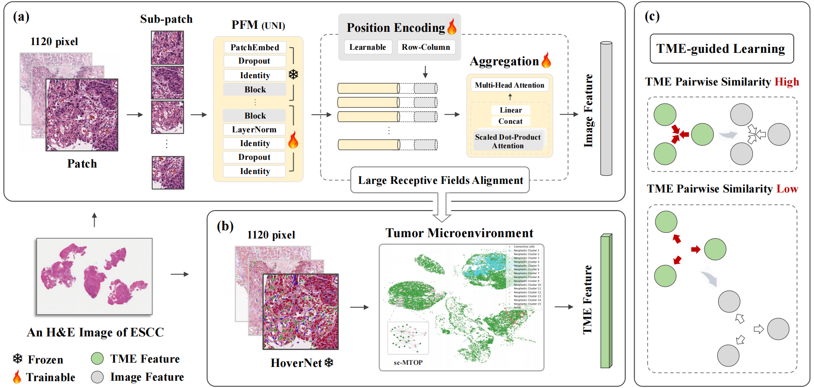

# [MICCAI 2025] Tumor Microenvironment-Guided Fine-Tuning of Pathology Foundation Models for Esophageal Squamous Cell Carcinoma Immunotherapy Response Prediction
*Yixuan Lin, Weiping Lin, Chenxu Guo, Xinxin Yang, Hongxue Meng, Liansheng Wang†*
<div align=left></div>

## Installation
- Clone this repo:
```shell
git clone https://github.com/stoney03/ESCC && cd ESCC
```
- Create a conda environment and activate it:
```shell
conda env create -f ESCC.yml
conda activate ESCC
```

## Image Preprocession and Feature Extraction

- We used [CLAM](https://github.com/mahmoodlab/CLAM) to split the slides and extract image features of patches by [UNI](https://github.com/mahmoodlab/UNI) and [Prov-Gigapath](https://github.com/prov-gigapath/prov-gigapath).

- Then, we used [Hovernet](https://github.com/vqdang/hover_net) to perform patch-level segmentation and classification of cells and [sc-MTOP](https://github.com/fuscc-deep-path/sc_MTOP) to extract TME features.
```shell
python feature_extract_TME.py
```

## Fine-tuning
- Select appropriate parameters to fine tune the model, and use the saved weights to extract features.
```shell
python train.py --gpus --csv_file --num_samples --freeze_layers --input_size --model
python infer.py --data_h5_dir --data_slide_dir --csv_path --input_size --feat_dir
```

## Citation
Please cite our paper if this work is helpful to your research.

